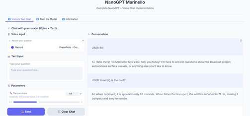

# NanoGPT Marinello

Prototype of a char-level LLM based on a Transformer decoder-only architecture, with multimodal pipeline (text and voice) and web interface.

This repository accompanies the Bachelor's thesis:  
**"CONVERSING WITH ROBOTS: BUILDING LLM ASSISTANTS TO UNDERSTAND AND UTILIZE AUTONOMOUS SYSTEMS"** – Francesco Pizzato, Università degli Studi di Padova, 2025.  



---

## Features

- Train a Transformer-based language model **from scratch** on a custom Q&A dataset.  
- Chat with the model via **text** or **voice** (speech-to-text with Whisper, text-to-speech with gTTS).  
- Simple **web interface** built with Gradio.  
- Support for **GPU with CUDA** or **CPU-only** environments.  
- Training and validation loss monitoring to detect overfitting.  

---

## Project Structure

```
NanoGPT-Marinello/
├── main.py          # entry point: loads checkpoint and launches the UI
├── config.py        # hyperparameters and shared runtime state
├── model.py         # Transformer architecture (CausalSelfAttention, MLP, Block, GPT)
├── dataset.py       # character-level dataset and batch sampling
├── checkpoint.py    # checkpoint loading
├── training.py      # training loop with validation loss monitoring
├── audio.py         # speech-to-text (Whisper) and text-to-speech (gTTS)
├── chat.py          # chat pipeline
├── ui.py            # Gradio interface (theme, CSS, layout)
├── Q&A_Dataset.txt  # sample training dataset
└── requirements.txt
```

---

## Requirements

- Python 3.10 or newer  
- PIP (updated)  
- Recommended: NVIDIA GPU with CUDA 11.8+  

Install dependencies:  
```bash
pip install -r requirements.txt
```

---

## Quick Start

1. Clone the repository:  
   ```bash
   git clone https://github.com/FrannPizz/NanoGPT-Marinello.git
   cd NanoGPT-Marinello
   ```

2. Launch the application:  
   ```bash
   python main.py
   ```

3. The browser will open automatically at [http://localhost:7860](http://localhost:7860).

If a checkpoint file (`nanoGPT_checkpoint.pth`) is present in the same folder, it will be loaded automatically at startup.  

---

## Dataset

The model is trained on a Q&A dataset with the following format:  

```
###Prompt: What is BlueBoat?
###Response: BlueBoat is an autonomous surface vessel developed as part of the NTNU projects...
```

The dataset can be extended with new domain-specific documents.  
A sample dataset is included in the repository.  

---

## Checkpoints

During training, checkpoints are automatically saved (model weights, optimizer state, vocabulary).  
Place the checkpoint file in the same directory as `main.py` for it to be loaded automatically at startup.  

Pretrained checkpoints available here:  
👉 [Google Drive – NanoGPT Marinello Checkpoints](https://drive.google.com/drive/folders/1ujhGUPyym-6Tz-gKI7FQYB2B36fxcPlF?usp=sharing)  

---

## Technical Details

- Transformer decoder-only  
- 8 layers, 8 attention heads, 512 embedding dimension  
- Context size: 128 tokens  
- Fixed ASCII printable vocabulary (100 characters, deterministic)  
- 90/10 train/validation split with per-step loss monitoring  
- Mixed precision training (float16) on GPU via GradScaler  
- Whisper for speech-to-text  
- gTTS for text-to-speech  
- Gradio for web interface  

---

## Reference

If you use this code or build upon it, please cite the thesis:

**Francesco Pizzato (2025)**  
*CONVERSING WITH ROBOTS: BUILDING LLM ASSISTANTS TO UNDERSTAND AND UTILIZE AUTONOMOUS SYSTEMS*  
Bachelor's thesis, Università degli Studi di Padova.  

---

## Author

**Francesco Pizzato** – [francesco.pizzato.1@studenti.unipd.it](mailto:francesco.pizzato.1@studenti.unipd.it)

---
